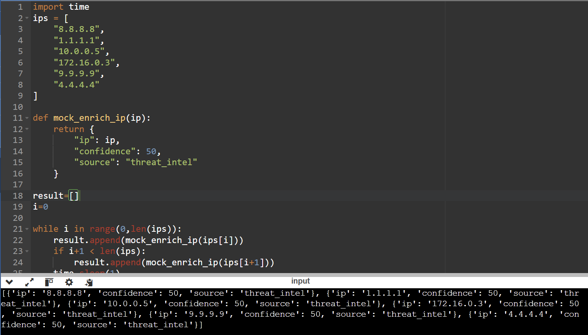

# 12. Scalable IOC Processing with Rate Limits

# Objective

<aside>


Process a large number of IOCs while respecting API rate limits by batching requests and throttling execution, without dropping data or crashing.

</aside>

### Input

```python
ips = [
    "8.8.8.8",
    "1.1.1.1",
    "10.0.0.5",
    "172.16.0.3",
    "9.9.9.9",
    "4.4.4.4"
]

def mock_enrich_ip(ip):
    return {
        "ip": ip,
        "confidence": 50,
        "source": "threat_intel"
    }
```

### Logic

We need to process 2 IP’s at once, showcasing the concept of rate limiting. So, we can use the python `time.sleep` function to add a 1 second delay after the function processes 2 IP’s.

```python
while i in range(0,len(ips)):
    result.append(mock_enrich_ip(ips[i]))
    if i+1 < len(ips):
        result.append(mock_enrich_ip(ips[i+1]))
    time.sleep(1)
    i+=2
```

### Final Code

```python
import time
ips = [
    "8.8.8.8",
    "1.1.1.1",
    "10.0.0.5",
    "172.16.0.3",
    "9.9.9.9",
    "4.4.4.4"
]

def mock_enrich_ip(ip):
    return {
        "ip": ip,
        "confidence": 50,
        "source": "threat_intel"
    }

result=[]
i=0
   
while i in range(0,len(ips)):
    result.append(mock_enrich_ip(ips[i]))
    if i+1 < len(ips):
        result.append(mock_enrich_ip(ips[i+1]))
    time.sleep(1)
    i+=2

print(result)
```

### Screenshot

