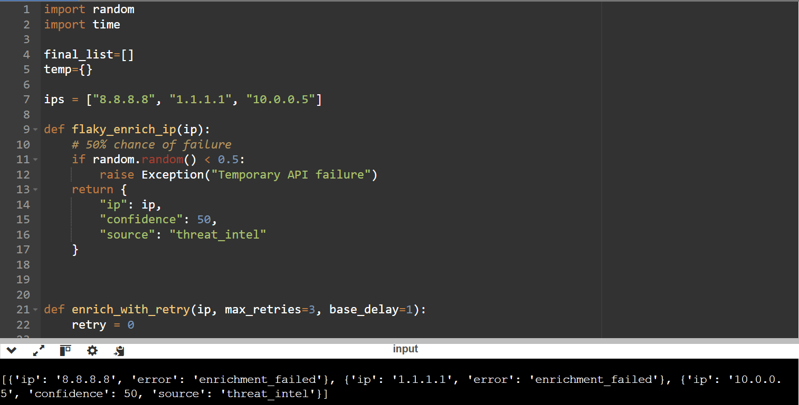

# 14. Resilient API Calls with Retries and Backoff

# Objective

<aside>


Implement retry logic with exponential backoff to handle transient failures (timeouts, 5xx errors) when calling external services, without overwhelming them.

</aside>

### Input

```python
import random
import time

ips = ["8.8.8.8", "1.1.1.1", "10.0.0.5"]

def flaky_enrich_ip(ip):
    # 50% chance of failure
    if random.random() < 0.5:
        raise Exception("Temporary API failure")
    return {
        "ip": ip,
        "confidence": 50,
        "source": "threat_intel"
    }
```

### Final Code

Here, we make use of the try except block to catch exceptions and retry.

```python
import random
import time

final_list=[]
temp={}

ips = ["8.8.8.8", "1.1.1.1", "10.0.0.5"]

def flaky_enrich_ip(ip):
    # 50% chance of failure
    if random.random() < 0.5:
        raise Exception("Temporary API failure")
    return {
        "ip": ip,
        "confidence": 50,
        "source": "threat_intel"
    }
    

def enrich_with_retry(ip, max_retries=3, base_delay=1):
    retry = 0

    while retry < max_retries:
        try:
            result = flaky_enrich_ip(ip)
            final_list.append(result)
            break

        except Exception:
            retry += 1

            if retry == max_retries:
                final_list.append({"ip": ip, "error": "enrichment_failed"})
                break

            time.sleep(base_delay * (2 ** (retry - 1)))
            
for i in ips:
    enrich_with_retry(i, max_retries=3, base_delay=1)

print(final_list)
```

### Screenshot

