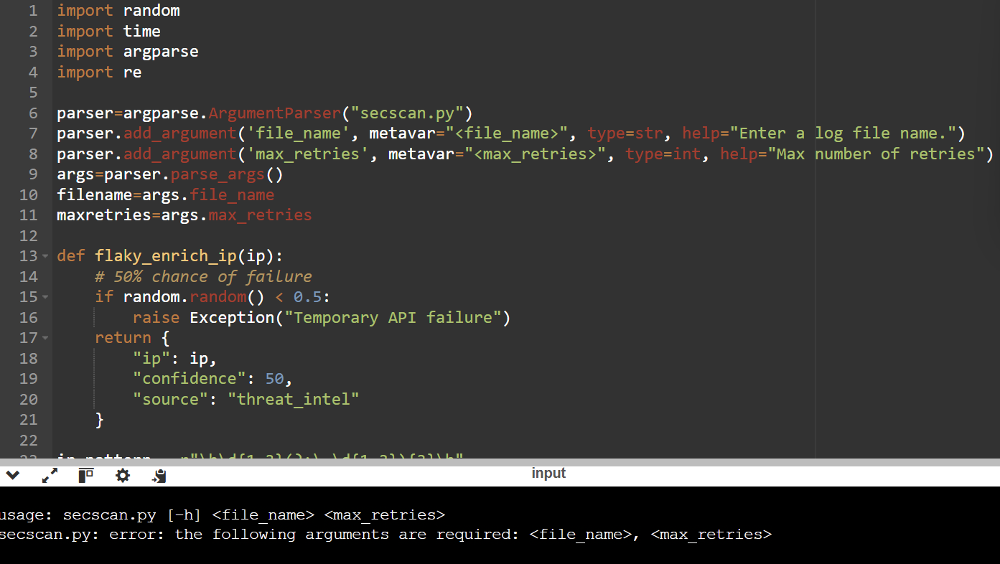

# 15. CLI-Based Security IOC Scanner

# Objective

<aside>


Build a command-line security tool that reads input from a file, processes IOCs, and outputs results just like real internal security tooling.

</aside>

### Input

Same as Day 14
Just take the file and number of retries from the user

`logs.txt`

```python
User login failed from 8.8.8.8
Internal scan from 10.0.0.5
Another hit from 1.1.1.1
```

### Final Code

```python
import random
import time
import argparse
import re

parser=argparse.ArgumentParser("secscan.py")
parser.add_argument('file_name', metavar="<file_name>", type=str, help="Enter a log file name.")
parser.add_argument('max_retries', metavar="<max_retries>", type=int, help="Max number of retries")
args=parser.parse_args()
filename=args.file_name
maxretries=args.max_retries

def flaky_enrich_ip(ip):
    # 50% chance of failure
    if random.random() < 0.5:
        raise Exception("Temporary API failure")
    return {
        "ip": ip,
        "confidence": 50,
        "source": "threat_intel"
    }

ip_pattern = r"\b\d{1,3}(?:\.\d{1,3}){3}\b"

try:
    with open(filename) as file:
        content=file.read()
        ip_addr = re.findall(ip_pattern,content)
        
except FileNotFoundError:
    print("File not found")
    

def enrich_with_retry(ip, maxretries=3, base_delay=1):
    retry = 0

    while retry < maxretries:
        try:
            result = flaky_enrich_ip(ip)
            if result["confidence"]>=80:
                print(f"[ALERT] {result["ip"]}  confidence={result["confidence"]}")
            else:
                print(f"[OK] {result["ip"]}  confidence={result["confidence"]}")
            break

        except Exception:
            retry += 1

            if retry == maxretries:
                print(f"[OK] {result["ip"]}  enrichment_failed")
                break

            time.sleep(base_delay * (2 ** (retry - 1)))
            
for i in ip_addr:
    enrich_with_retry(i, maxretries=3, base_delay=1)
```

### Screenshot



