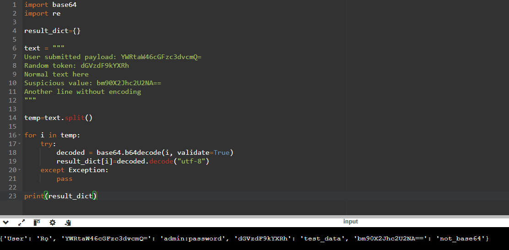

# 8. Base64 Detection & Decoding

# Objective

<aside>


Identify Base64-encoded strings embedded in log data, safely decode them, and extract readable content without crashing on invalid input.

</aside>

### Input

```cpp
text = """
User submitted payload: YWRtaW46cGFzc3dvcmQ=
Random token: dGVzdF9kYXRh
Normal text here
Suspicious value: bm90X2Jhc2U2NA==
Another line without encoding
"""
```

### Logic

It validates every word and checks if it is a valid base64 or not. If yes, then it is added to the dictionary.

```cpp
temp=text.split()

for i in temp:
    try:
        decoded = base64.b64decode(i, validate=True)
        result_dict[i]=decoded.decode("utf-8")
    except Exception:
        pass
```

### Final Code

```cpp
import base64
import re

result_dict={}

text = """
User submitted payload: YWRtaW46cGFzc3dvcmQ=
Random token: dGVzdF9kYXRh
Normal text here
Suspicious value: bm90X2Jhc2U2NA==
Another line without encoding
"""

temp=text.split()

for i in temp:
    try:
        decoded = base64.b64decode(i, validate=True)
        result_dict[i]=decoded.decode("utf-8")
    except Exception:
        pass

print(result_dict)
```


### Screenshot

