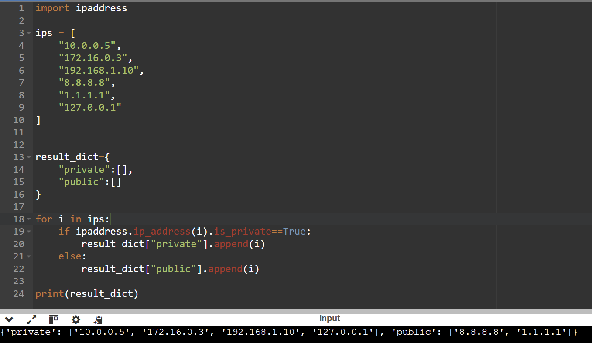

# 9. Private vs Public IP Filtering

# Objective

<aside>


Given a list of IP addresses extracted from logs or alerts, classify them as **private** or **public** IPs so analysts can focus on externally exposed threats.

</aside>

### Input

```cpp
ips = [
    "10.0.0.5",
    "172.16.0.3",
    "192.168.1.10",
    "8.8.8.8",
    "1.1.1.1",
    "127.0.0.1"
]
```

### Logic

We just append the private IP’s to private key and public to public key. We have to define the keys while defining the dictionary itself. This makes it easier to assign a value to a key in the loop.

```cpp
result_dict={
    "private":[],
    "public":[]
}

for i in ips:
    if ipaddress.ip_address(i).is_private==True:
        result_dict["private"].append(i)
    else:
        result_dict["public"].append(i)
```

### Final Code

```cpp
import ipaddress

ips = [
    "10.0.0.5",
    "172.16.0.3",
    "192.168.1.10",
    "8.8.8.8",
    "1.1.1.1",
    "127.0.0.1"
]

result_dict={
    "private":[],
    "public":[]
}

for i in ips:
    if ipaddress.ip_address(i).is_private==True:
        result_dict["private"].append(i)
    else:
        result_dict["public"].append(i)

print(result_dict)
```

### Screenshot

