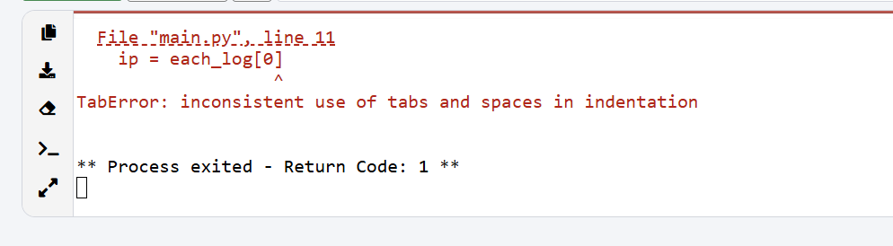

# Examples and Common Errors



If you ever encounter this, it is because some of the lines are indented by space and some by tabs. So just make sure you remove all the spaces and just use enter to go to the next line.

# ArgParse Example

Here, metavar is the variable displayed on the CLI, but the real variable used in the code is the first parameter in the `add_argument` ; i.e: `num`.

Adding `--` makes it an optional argument; i.e. (--num)

```python
import argparse
parser=argparse.ArgumentParser("script.py")
parser.add_argument('num', metavar="number", type=int, help="Enter a number to be printed")
args=parser.parse_args()
number=args.num
print (number)
```

# File Read Example

```python
with open('test.txt') as file:
    print(file.read())
    
# Safely handling input of files by using try and except

try:
    with open('test.txt') as file:
        print(file.read())
        
except FileNotFoundError:
    print("File not found")
```

# File Write Example

```python
data="Hello, this is the test output file"
filepath="output.txt"
with open(filepath,"w") as file:
    file.write(data)
```

# CSV Write Example

```python
import csv

with open("names.csv","w") as file:
    columns=['first_name', 'last_name', 'email']
    csv_writer = csv.DictWriter(file, fieldnames=columns)
    csv_writer.writeheader()
    
    csv_writer.writerow({"first_name":"Dhanush", "last_name":"Nair","email":"dhanushnair37@gmail.com"})
```
